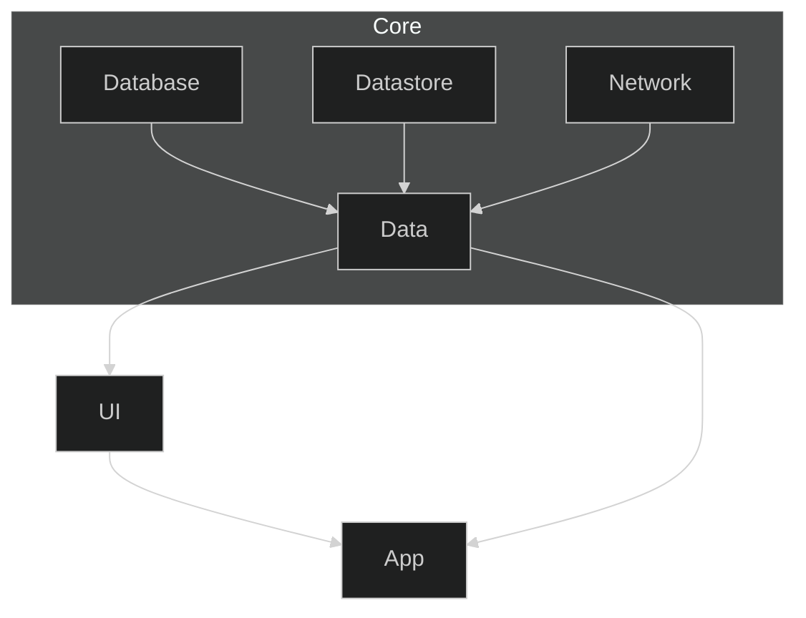
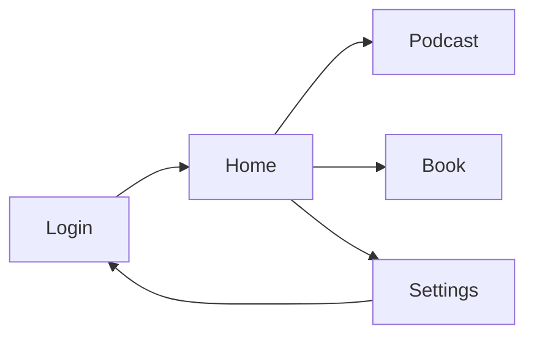

# 📖 Project Documentation

## 🔗 Module Dependencies

Below is a diagram representing the module dependencies in this project. Arrows indicate dependencies.
For example: **Network** → **Data** means **Data** depends on **Network**, or in other words, **Network**
code is accessible within the **Data** module.



## 📱 Screen Flow

<details>
<summary>Overall</summary>



</details>

## 🏷️ Naming & Coding Convention

#### Each screen can have their own repository to retrieve data.

```kotlin
HomeScreen.kt
HomeRepository.kt
```

#### There are 2 types of repositories

* Related to Screen `HomeRepository.kt`
* Related to Data `ProgressRepo.kt`

More documentation will be added in the future.

