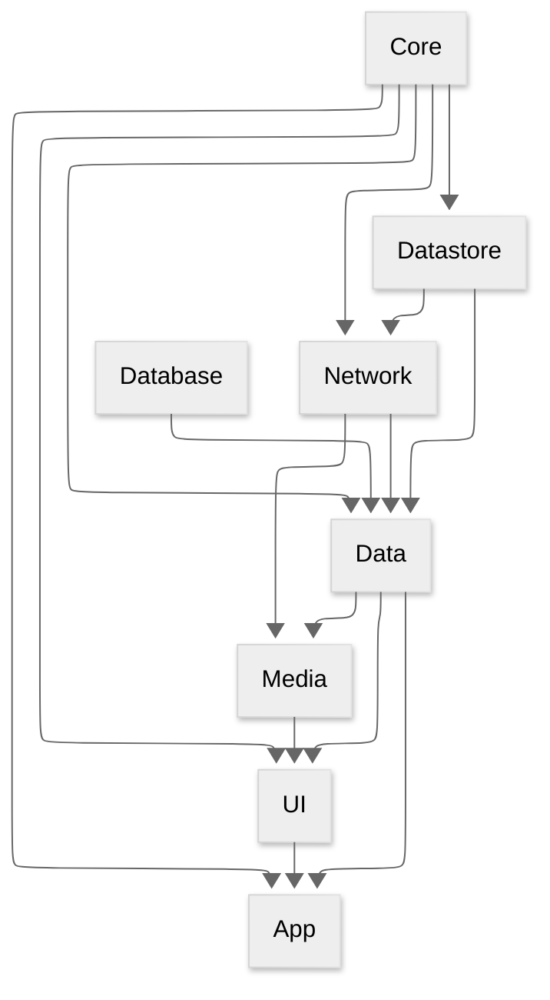

# 📖 Project Documentation

## 🔗 Module Dependencies

Below is a diagram representing the module dependencies in this project. Arrows indicate
dependencies.
For example: **Network** → **Data** means **Data** depends on **Network**, or in other words, *
*Network**
code is accessible within the **Data** module.



## 📱 Screen Flow

<details>
<summary>Overall</summary>
Screen with orange border indicate that mini player will be shown when there is an ongoing playback.

```mermaid
---
config:
theme: dark
---
flowchart LR
    B[Book]
    E[Episode]
    H[Home]
    L[Login]
    P[Podcast]
    Pl[Player]
    S[Settings]
    L --> H
    H --> P
    P --> E
    H --> B
    H --> S
class B, E, H, P, Pl primary
classDef primary stroke: #FFC981
```

</details>

## 🏷️ Naming & Coding Convention

#### Each screen can have their own repository to retrieve data.

```kotlin
HomeScreen.kt
HomeRepository.kt
```

#### There are 2 types of repositories

* Related to Screen `HomeRepository.kt`
* Related to Data `ProgressRepo.kt`

More documentation will be added in the future.

