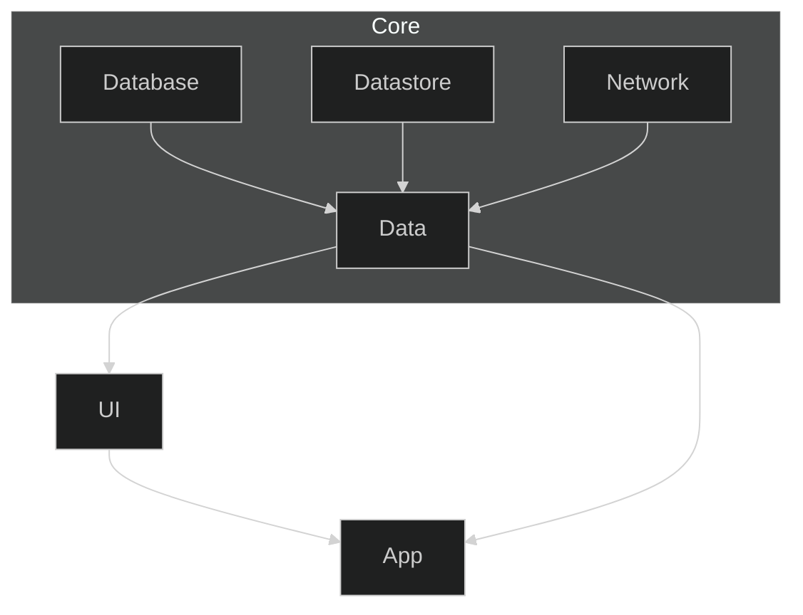

# 📖 Project Documentation

## 🔗 Module Dependencies

Below is a diagram representing the module dependencies in this project:

```mermaid
---
config:
  theme: dark
---
flowchart TD
    A[App]
    D[Data]
    S[Datastore]
    N[Network]
    B[Database]
    U[UI]

    D --> U
    U --> A
    D --> A

    subgraph Core
    B --> D
    S --> D
    N --> D
    end
```

More documentation will be added in the future.

