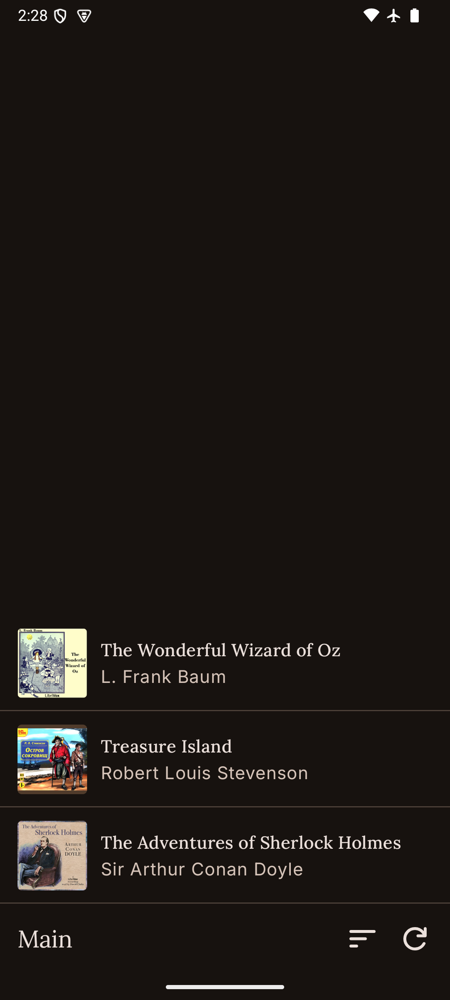
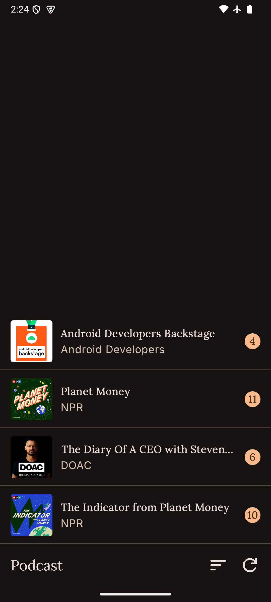
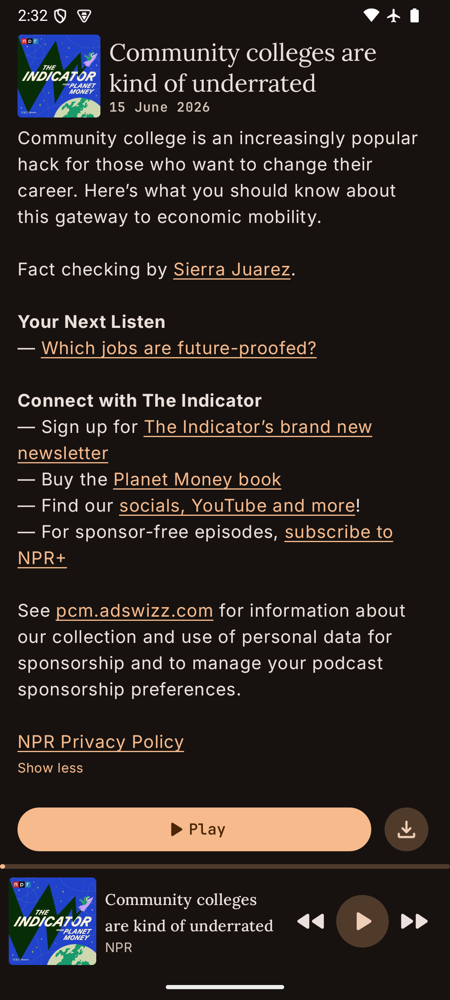
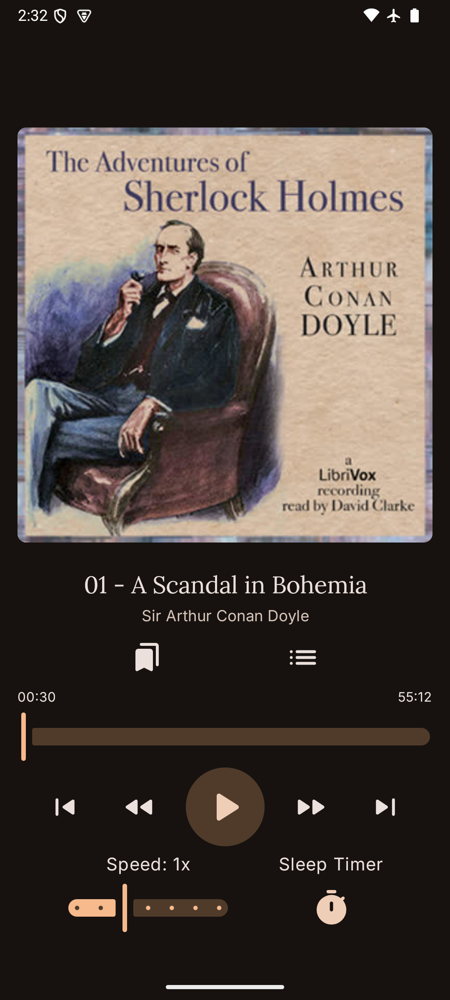
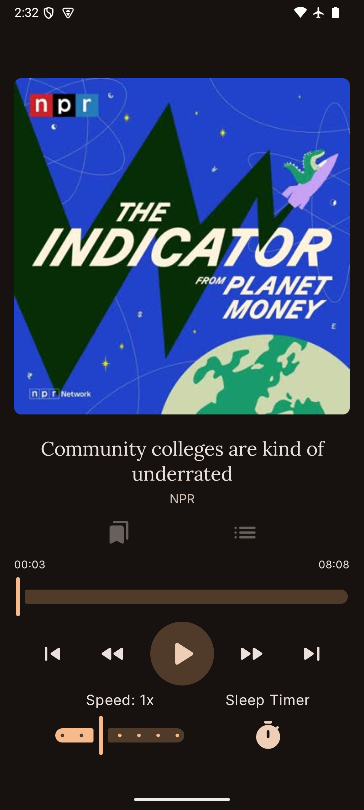
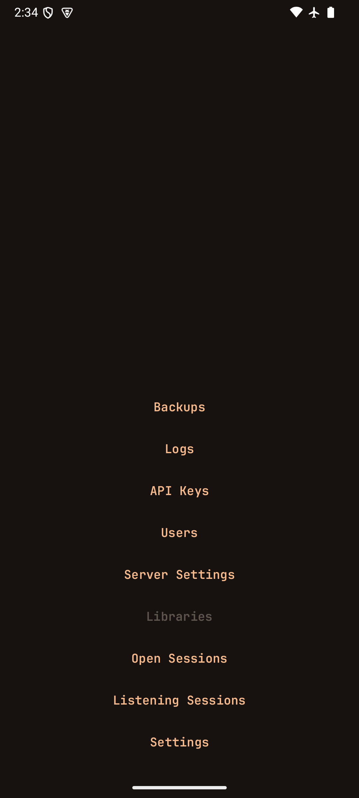
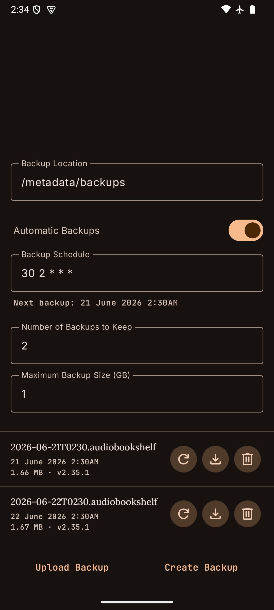
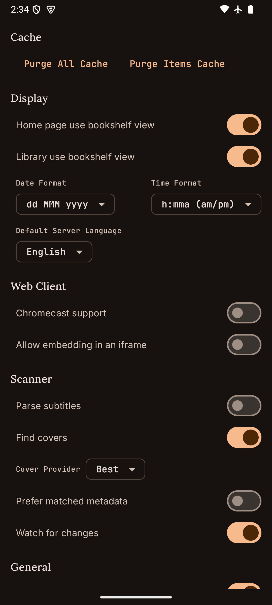
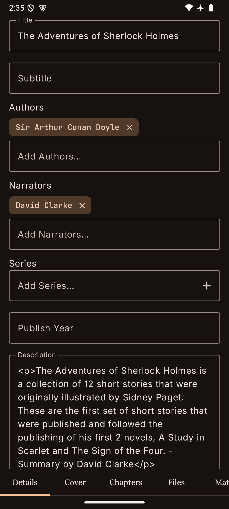

<h1 align="center">ShelfDroid</h1>

  

  
  
  

  
  
  

ShelfDroid is a third-party Android client for self-hosted [Audiobookshelf](https://github.com/advplyr/audiobookshelf) servers. Use it to browse audiobook and podcast libraries, stream playback from your server, keep listening offline on your Android device, and handle common server management tasks from the same app.

## Features

- Browse audiobook and podcast libraries from your Audiobookshelf server
- Stream audiobooks and podcast episodes with synced progress
- Download books and episodes for durable offline playback
- Use chapters, bookmarks, sleep timer, playback speed, and player controls
- Manage backups, API keys, users, logs, and server settings when your account has permission
- Review listening sessions and other admin screens available to your account
- Customize sorting, display preferences, and playback settings

## Screenshots

  

    
    
    
    
  

  

    
    
    
    
  

  

    
    
    
  

## Requirements

- An Audiobookshelf server you can sign in to
- Android 10 or newer
- JDK 17 for local builds

## Roadmap

- [x] Implement core audiobook streaming functionality
- [x] Add offline downloading and playback
- [ ] Improve search and filtering features
- [ ] Introduce custom themes for personalization
- [ ] Add in-app settings for customization
- [ ] Integrate Google Assistant for voice control
- [x] Enhance playback controls with bookmarks and sleep timers
- [x] Develop a modern and user-friendly UI
- [x] Support audiobook chapters for easy navigation

See the [issue tracker](https://github.com/100nandoo/shelfdroid/issues) for current work and feature requests.

## Documentation

Project documentation lives in [docs/DOCS.md](docs/DOCS.md), including code style and architecture notes. Recent release notes are tracked in [CHANGELOG.md](CHANGELOG.md).

## Acknowledgements

- [Audiobookshelf](https://github.com/advplyr/audiobookshelf) for the server platform ShelfDroid connects to

## Star History

## Contributing

1. Fork the repository.
2. Create a feature branch with `git checkout -b feature/YourFeatureName`.
3. Make your changes, run formatting, and test the affected code.
4. Commit your changes. If you use Commitizen, run `cz c`.
5. Push your branch and open a pull request.

## License

ShelfDroid is open source under the GNU Affero General Public License v3.0.

---

Copyright (c) 2026 100nandoo
