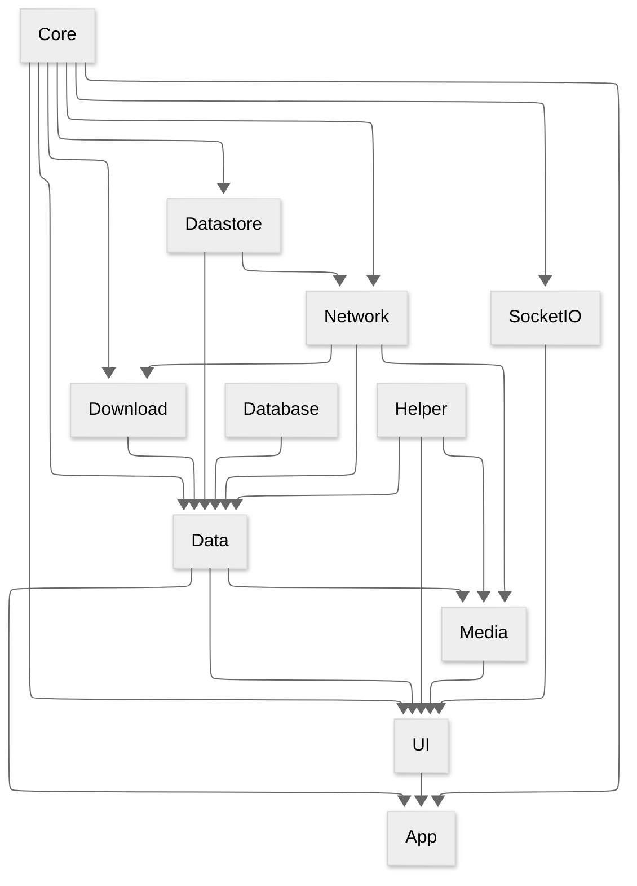

# 📖 Project Documentation

## 🔗 Module Dependencies

Below is a diagram representing the module dependencies in this project. Arrows indicate
dependencies.
For example: **Network** → **Data** means **Data** depends on **Network**, or in other words, *
*Network**
code is accessible within the **Data** module.



## 📱 Screen Flow

<details>
<summary>Overall</summary>
Screen with orange border indicate that mini player will be shown when there is an ongoing playback.

```mermaid
---
config:
theme: dark
---
flowchart LR
    L[Login]
    H[Home]
    S[Settings]
    SPo[Search Podcast]
    P[Podcast]
    B[Book]
    E[Episode]
    AE[Add Episode]
    LS[Listening Session]
    OS[Open Session]
    US[Users Settings]
    AP[Add Podcast]
    SPB[Settings Playback]
    STP[Settings Podcast]
    SLS[Settings Listening Session]
    Pl[Player]
    L --> H
    H --> S
    H --> P
    H --> B
    H --> SPo
    H --> LS
    H --> OS
    H --> US
    P --> E
    P --> AE
    SPo --> AP
    AP --> P
    S --> SPB
    S --> STP
    S --> SLS
    S --> L
    class H, P, B, E, Pl primary
    classDef primary stroke: #FFC981
```

</details>

## 🏷️ Naming & Coding Convention

#### Each screen can have their own repository to retrieve data.

```kotlin
HomeScreen.kt
HomeRepository.kt
```

#### There are 2 types of repositories

* Related to Screen `HomeRepository.kt`
* Related to Data `ProgressRepo.kt`

More documentation will be added in the future.
