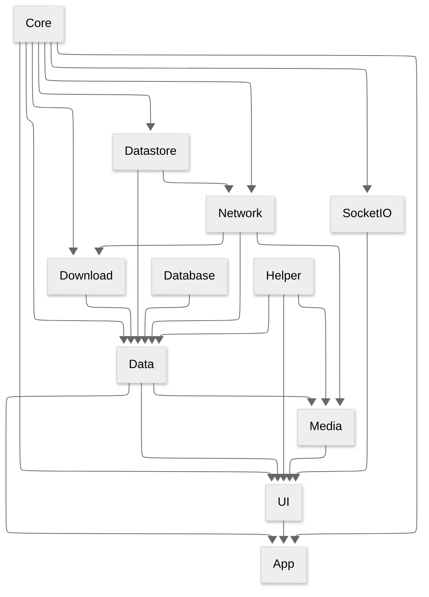

# 📖 Project Documentation

## Requirements

- An Audiobookshelf server you can sign in to
- Android 10 or newer
- JDK 17 for local builds

## Contributing

1. Fork the repository.
2. Create a feature branch with `git checkout -b feature/YourFeatureName`.
3. Make your changes, run formatting, and test the affected code.
4. Commit your changes. If you use Commitizen, run `cz c`.
5. Push your branch and open a pull request.

## 🔗 Module Dependencies

Below is a diagram representing the module dependencies in this project. Arrows indicate
dependencies.
For example: **Network** → **Data** means **Data** depends on **Network**, or in other words, *
*Network**
code is accessible within the **Data** module.


```mermaid
---
config:
  layout: elk
  theme: neutral
  look: neo
---
flowchart TD
%% Relationships
    C --> A & D & S & N & U & Do
    S --> D & N
    B --> D
    N --> D & M & Do
    D --> U & A & M
    U --> A
    M --> U
    SI --> U
    H --> D & U & M
    Do --> D
    C --> SI
%% Declarations
    C["Core"]
    A["App"]
    U["UI"]
    N["Network"]
    S["Datastore"]
    B["Database"]
    D["Data"]
    M["Media"]
    Do["Download"]
    H["Helper"]
    SI["SocketIO"]
```

## 📱 Screen Flow

<details>
<summary>Overall</summary>
Screen with orange border indicate that mini player will be shown when there is an ongoing playback.

```mermaid
---
config:
theme: dark
---
flowchart LR
    L[Login]
    H[Home]
    S[Settings]
    SPo[Search Podcast]
    P[Podcast]
    B[Book]
    E[Episode]
    AE[Add Episode]
    LS[Listening Session]
    OS[Open Session]
    US[Users Settings]
    AP[Add Podcast]
    SPB[Settings Playback]
    STP[Settings Podcast]
    SLS[Settings Listening Session]
    Pl[Player]
    L --> H
    H --> S
    H --> P
    H --> B
    H --> SPo
    H --> LS
    H --> OS
    H --> US
    P --> E
    P --> AE
    SPo --> AP
    AP --> P
    S --> SPB
    S --> STP
    S --> SLS
    S --> L
class H, P, B, E, Pl primary
classDef primary stroke: #FFC981
```

</details>

## 🏷️ Naming & Coding Convention

#### Each screen can have its own repository to retrieve and shape UI data.

```kotlin
HomeScreen.kt
HomeRepository.kt
```

#### The data layer uses domain-oriented repositories and data sources.

- Screen repositories assemble data for a specific screen or flow, such as `HomeRepository`.
- Data-layer repositories are named after the data they own, such as `LibraryRepository`,
  `LibraryItemRepository`, `PodcastEpisodeRepository`, `ProgressRepository`, or
  `UserRepository`.
- Single-source helpers should not be named `*Repository`. Use `*LocalDataSource` or
  `*RemoteDataSource` when a class only talks to one source of truth.
- Repository methods should use explicit verbs such as `refresh`, `sync`, `fetch`, `list`,
  `observe`, `update`, and `delete` instead of vague names like `local()` or `remote()`.

#### `Catalog` is the main data-layer umbrella for media browsing.

In ShelfDroid, the **Catalog** is the app view of the media available on the current
Audiobookshelf server. It includes:

- **Libraries**
- **Library folders**
- **Library items**
- **Books**
- **Podcasts**
- **Episodes**

Catalog-related repositories live under `core.data.catalog`. The main public seams are:

- `LibraryRepository`
- `LibraryItemRepository`
- `PodcastEpisodeRepository`

#### Screen repositories may depend on more than one public repository.

ShelfDroid does not force every read through a single facade. If a screen reflects multiple
real domain seams, it can depend on multiple public repositories directly.

For example:

- Podcast- and player-related flows may use both `LibraryItemRepository` and
  `PodcastEpisodeRepository`
- Listening flows may combine Catalog repositories with `ProgressRepository` or
  `BookmarkRepository`

#### Other public repository areas follow domain concepts, not technical buckets.

- `core.data.catalog` for Catalog data
- `core.data.listening` for `ProgressRepository`, `BookmarkRepository`, and
  `ListeningStatsRepository`
- `core.data.users` for `UserRepository`
- `core.data.tags` for `TagRepository`
- `core.data.podcastsourcefeed` for `PodcastSourceFeedRepository`

This is intentional. Avoid catch-all packages that group classes by legacy implementation
history instead of domain ownership.

## 🎨 Code Style And Formatting

ShelfDroid uses [ktfmt](https://github.com/facebook/ktfmt) with Google's Kotlin style.

```bash
find . \( -path './.idea' -o -path './build' \) -prune -o \
  -name '*.kt' -print | xargs ktfmt --google-style
```

The command skips `.idea/` and `build/` so only real source files are formatted.

## 🎨 UI Development

- [Compose Preview Policy](./ui-previews.md)

## 📦 Distribution

- [F-Droid Asset Provenance](./fdroid/asset-provenance.md)
- [F-Droid Release Procedure](./fdroid/release-procedure.md)

## 🧱 Architecture

ShelfDroid follows
the [Android Architecture Templates (Multi-Module)](https://github.com/android/architecture-templates/tree/multimodule)
to keep the codebase scalable and maintainable.

- [Data Layer Seams ADR](./adr/0007-domain-oriented-data-layer-seams.md)
- [Download Module](./architecture/download-module.md)
