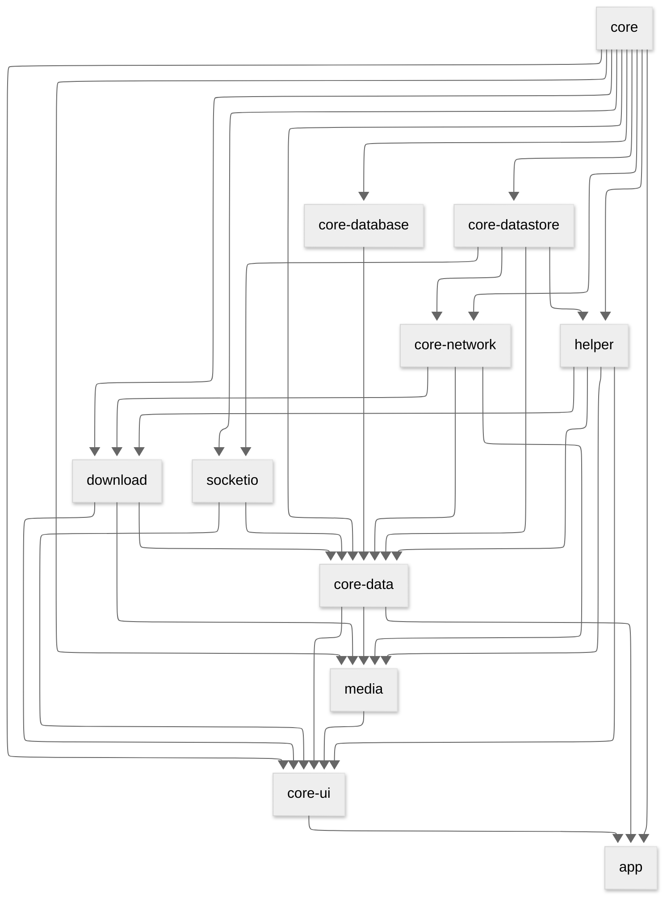
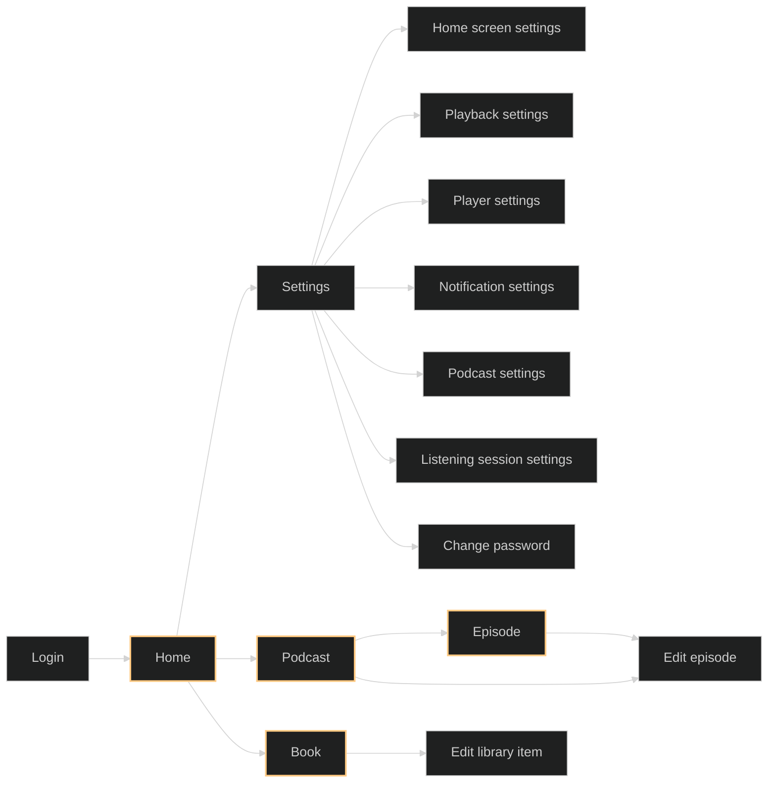
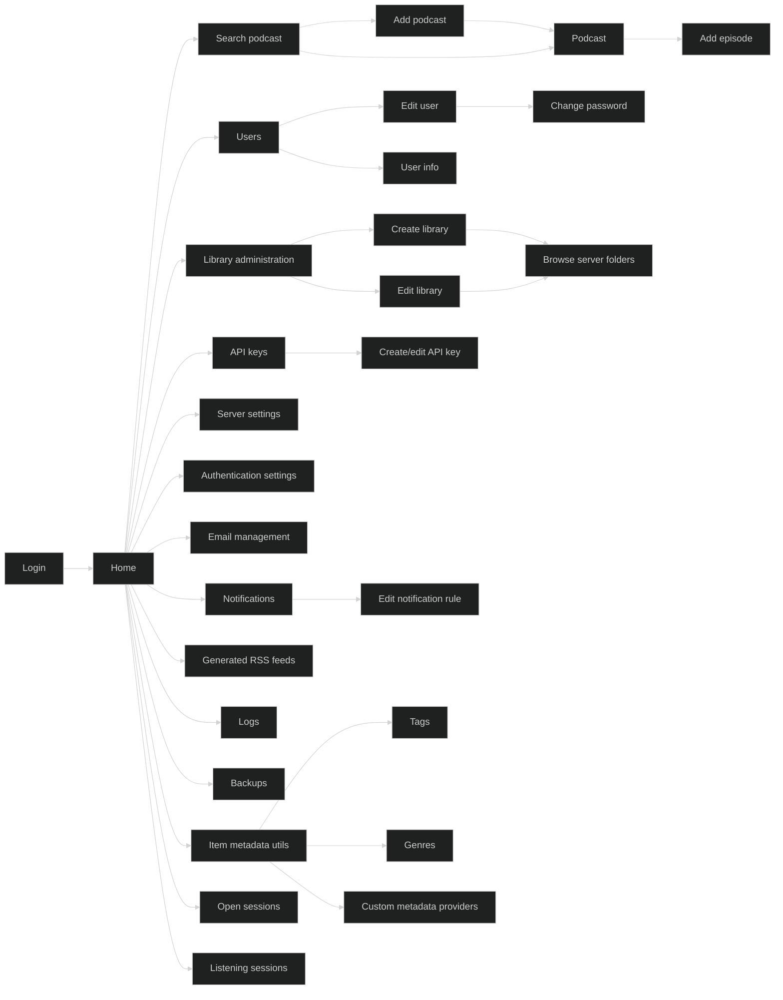

# 📖 Project Documentation

## Requirements

- An Audiobookshelf server you can sign in to
- Android 10 or newer
- JDK 17 for local builds

## Contributing

1. Fork the repository.
2. Create a feature branch with `git checkout -b feature/YourFeatureName`.
3. Make your changes, run formatting, and test the affected code.
4. Commit your changes. If you use Commitizen, run `cz c`.
5. Push your branch and open a pull request.

## 🔗 Module Dependencies

[View module dependencies diagram](./images/module_dependencies.svg)

The diagram shows the runtime module dependencies in this project. An arrow points from a
dependency to the module that depends on it. For example, **core-network** → **core-data** means
that **core-data** can use code from **core-network**.


```mermaid
---
config:
  layout: elk
  theme: neutral
  look: neo
---
flowchart TD
    Core["core"] --> App["app"]
    Core --> Data["core-data"]
    Core --> Database["core-database"]
    Core --> Datastore["core-datastore"]
    Core --> Network["core-network"]
    Core --> Download["download"]
    Core --> Helper["helper"]
    Core --> SocketIO["socketio"]
    Core --> UI["core-ui"]
    Core --> Media["media"]

    Data --> App
    UI --> App
    Data --> UI
    Data --> Media
    Database --> Data
    Datastore --> Data
    Datastore --> Network
    Datastore --> Helper
    Datastore --> SocketIO
    Network --> Data
    Network --> Download
    Network --> Media
    Download --> Data
    Download --> UI
    Download --> Media
    Media --> UI
    Helper --> Data
    Helper --> Download
    Helper --> UI
    Helper --> Media
    SocketIO --> Data
    SocketIO --> UI
```

The test-only modules are outside the runtime graph: **core-testing** provides shared test
infrastructure, **test-app** is the instrumentation target for **app**, and **benchmark** runs
macrobenchmarks against **app**. **core-data** uses **core-testing** from its Android tests.

## 📱 Screen Flow

Back and save actions return to the previous navigation-stack entry and are omitted from the
diagrams below for readability. Logging out from `Settings` returns to `Login`.

<details>
<summary>User</summary>

[View user screen flow diagram](./images/screen_flow_user.svg)

The player is an overlay managed by `PlayerHandler`, not a navigation destination. The orange
border marks the routes where it can be shown during ongoing playback: `Home`, `Book`, `Podcast`,
and `Episode`. It is temporarily hidden on login, settings, and administration routes.

The edit routes are available to users with the server's update permission; they are not limited to
administrators. The administrator-only search and add routes are shown in the flow below.


```mermaid
---
config:
  theme: dark
---
flowchart LR
    L["Login"]
    H["Home"]
    S["Settings"]
    P["Podcast"]
    B["Book"]
    E["Episode"]
    EditItem["Edit library item"]
    EditEpisode["Edit episode"]
    ChangePassword["Change password"]
    SettingsHome["Home screen settings"]
    SettingsPlayback["Playback settings"]
    SettingsPlayer["Player settings"]
    SettingsNotification["Notification settings"]
    SettingsPodcast["Podcast settings"]
    SettingsListeningSession["Listening session settings"]

    L --> H
    H --> S
    H --> P
    H --> B
    P --> E
    P --> EditEpisode
    B --> EditItem
    E --> EditEpisode

    S --> SettingsHome
    S --> SettingsPlayback
    S --> SettingsPlayer
    S --> SettingsNotification
    S --> SettingsPodcast
    S --> SettingsListeningSession
    S --> ChangePassword

class H,P,B,E primary;
classDef primary stroke:#FFC981,stroke-width:2px;
```

</details>

<details>
<summary>Administrator</summary>

[View administrator screen flow diagram](./images/screen_flow_admin.svg)

The server section on `Home` is visible only to administrators. This flow is in addition to the
user flow above; it shows the administrator-only server screens and entry points.


```mermaid
---
config:
  theme: dark
---
flowchart LR
    L["Login"]
    H["Home"]
    Search["Search podcast"]
    AddPodcast["Add podcast"]
    P["Podcast"]
    AddEpisode["Add episode"]
    Users["Users"]
    EditUser["Edit user"]
    UserInfo["User info"]
    ChangePassword["Change password"]
    Libraries["Library administration"]
    CreateLibrary["Create library"]
    EditLibrary["Edit library"]
    ServerFolders["Browse server folders"]
    ApiKeys["API keys"]
    EditApiKey["Create/edit API key"]
    ServerSettings["Server settings"]
    AuthenticationSettings["Authentication settings"]
    EmailManagement["Email management"]
    Notifications["Notifications"]
    EditNotificationRule["Edit notification rule"]
    RssFeeds["Generated RSS feeds"]
    Logs["Logs"]
    Backups["Backups"]
    MetadataUtils["Item metadata utils"]
    Tags["Tags"]
    Genres["Genres"]
    CustomMetadata["Custom metadata providers"]
    OpenSessions["Open sessions"]
    ListeningSessions["Listening sessions"]

    L --> H
    H --> Search
    H --> Users
    H --> Libraries
    H --> ApiKeys
    H --> ServerSettings
    H --> AuthenticationSettings
    H --> EmailManagement
    H --> Notifications
    H --> RssFeeds
    H --> Logs
    H --> Backups
    H --> MetadataUtils
    H --> OpenSessions
    H --> ListeningSessions

    Search --> AddPodcast
    Search --> P
    AddPodcast --> P
    P --> AddEpisode

    CreateLibrary --> ServerFolders
    EditLibrary --> ServerFolders

    Users --> EditUser
    Users --> UserInfo
    EditUser --> ChangePassword

    Libraries --> CreateLibrary
    Libraries --> EditLibrary

    ApiKeys --> EditApiKey

    Notifications --> EditNotificationRule

    MetadataUtils --> Tags
    MetadataUtils --> Genres
    MetadataUtils --> CustomMetadata
```

</details>

## 🏷️ Naming & Coding Convention

#### Each screen can have its own repository to retrieve and shape UI data.

```kotlin
HomeScreen.kt
HomeRepository.kt
```

#### The data layer uses domain-oriented repositories and data sources.

- Screen repositories assemble data for a specific screen or flow, such as `HomeRepository`.
- Data-layer repositories are named after the data they own, such as `LibraryRepository`,
  `LibraryItemRepository`, `PodcastEpisodeRepository`, `ProgressRepository`, or
  `UserRepository`.
- Single-source helpers should not be named `*Repository`. Use `*LocalDataSource` or
  `*RemoteDataSource` when a class only talks to one source of truth.
- Repository methods should use explicit verbs such as `refresh`, `sync`, `fetch`, `list`,
  `observe`, `update`, and `delete` instead of vague names like `local()` or `remote()`.

#### Library data repositories own media library data.

In ShelfDroid, the **Catalog** is the app view of the media available on the current
Audiobookshelf server. It includes:

- **Libraries**
- **Library folders**
- **Library items**
- **Books**
- **Podcasts**
- **Episodes**

Library-related repositories live under `core.data.library`. The main public seams are:

- `LibraryDataRepository`
- `LibraryRepository`
- `LibraryItemRepository`
- `PodcastEpisodeRepository`

#### Screen repositories may depend on more than one public repository.

ShelfDroid does not force every read through a single facade. If a screen reflects multiple
real domain seams, it can depend on multiple public repositories directly.

For example:

- Podcast- and player-related flows may use both `LibraryItemRepository` and
  `PodcastEpisodeRepository`
- Listening flows may combine Library repositories with `ProgressRepository` or
  `BookmarkRepository`

#### Other public repository areas follow domain concepts, not technical buckets.

- `core.data.library` for Library and LibraryItem data
- `core.data.listening` for `ProgressRepository`, `BookmarkRepository`, and
  `ListeningStatsRepository`
- `core.data.users` for `UserRepository`
- `core.data.tags` for `TagRepository`
- `core.data.podcastsourcefeed` for `PodcastSourceFeedRepository`

This is intentional. Avoid catch-all packages that group classes by legacy implementation
history instead of domain ownership.

## 🎨 Code Style And Formatting

ShelfDroid uses [ktfmt](https://github.com/facebook/ktfmt) with Google's Kotlin style.

```bash
find . \( -path './.idea' -o -path './build' \) -prune -o \
  -name '*.kt' -print | xargs ktfmt --google-style
```

The command skips `.idea/` and `build/` so only real source files are formatted.

## 🎨 UI Development

- [Compose Preview Policy](./ui-previews.md)

## 📦 Distribution

- [F-Droid Asset Provenance](./fdroid/asset-provenance.md)
- [F-Droid Release Procedure](./fdroid/release-procedure.md)

## 🧱 Architecture

ShelfDroid follows
the [Android Architecture Templates (Multi-Module)](https://github.com/android/architecture-templates/tree/multimodule)
to keep the codebase scalable and maintainable.

- [Data Layer Seams ADR](./adr/0007-domain-oriented-data-layer-seams.md)
- [Download Module](./architecture/download-module.md)
